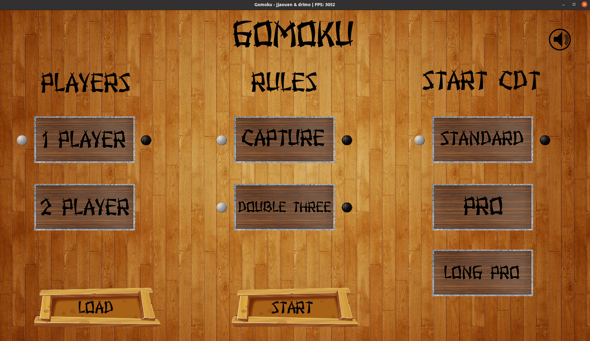
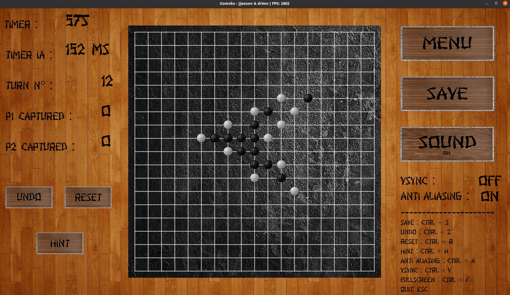

<h1>GOMOKU</h1> 
 

<h2>Description</h2>
The goal of this project is to make an AI capable of beating human players at Gomoku with a 500ms constraint to play its turn.
This project IA using an alpha beta pruning algo with a homemade heuristic.
The GUI is made with a golang library named Pixel (based on OpenGL).
 

<h2>Installation</h2> 

Requirements: `Golang version >= 1.13.0`. 

You must install the following dependencies : `libasound2-dev`, `libgl1-mesa-dev` and `xorg-dev`. 

<h3>On Linux:</h3> 

`make linux-deps` 
`make goget` 
`make` 
 
You can now run gomoku. :)

<h3>On Windows:</h3>

You can use the precompiled executable in folder `gomoku-W64-1.0.0`.

or

Compiled the project on WSL and using a tool like Xlaunch to be able to launch the project.

or 

Compiled the project on Mingw-w64 with:

`make goget` 
`make windows` 

(You still nedd install the proper dependencies on Mingw-w64). 

You can now run gomoku. :)

<h2>Parameters</h2> 

`-d or --depth <int> :` Set the depth of the Alpha Beta pruning algo. (default: 5) 
`-w or --width <int> :` Set the width of the Alpha Beta pruning algo. (default: 8) 
`-r or --routine :` Disable go routine (Debug purpose). 
`-ia:` An IA plays for you (Debug purpose) 

Note: The default depth and width is a compromise between performance and efficiency. High values can lead to very long computation time. 

<h2>Rules:</h2> 

- To win you must do a 5-in-row.

- You can capture a pair of your ennemy stones, 5 capture lead to a win. If your 5-in-row is threatened by a capture, you won't win. (Can be disabled on the main menu) 

- A double three is not allowed. (Can be disabled on the main menu) 

- Detailed rules in the subject: [here](./en.subject.pdf) 

<h2>Controls</h2> 

The game can completely be play with the mouse, but here are some shortcuts: 
`CTRL + Z`: Undo 
`CTRL + R`: Reset game 
`CTRL + H`: Gives you a hint 
`CTRL + S`: Save game (you can load it on the main menu) 
`CTRL + C`: Show the potential captures on board (cheating is bad :) ) 
`CTRL + V`: Activate vsync 
`CTRL + F`: Fullscreen mode 
`CTRL + A`: Activate AA (smooth mode) 

<h2>Screenshots</h2>

 

 

<h2>Grade</h2>

`124/100`